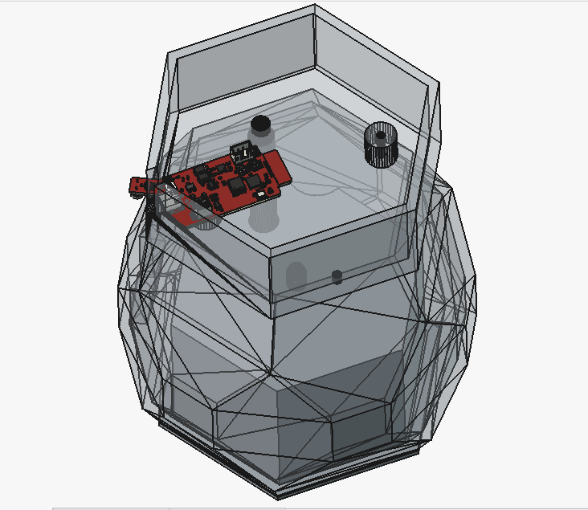
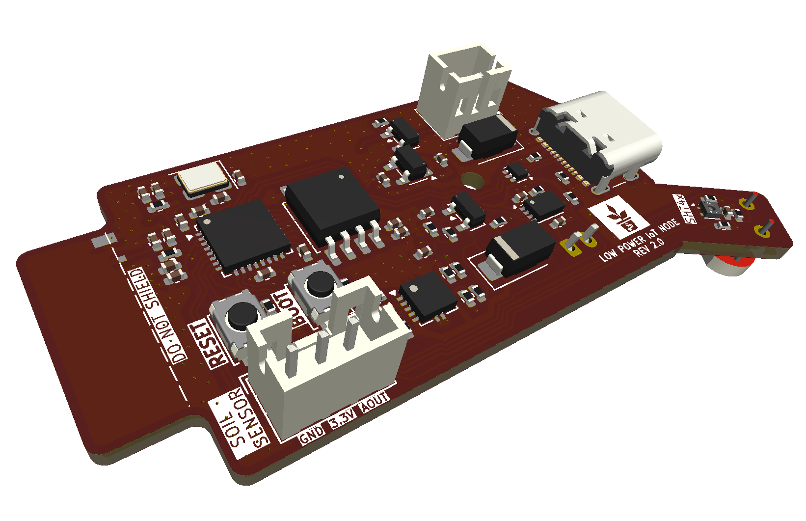
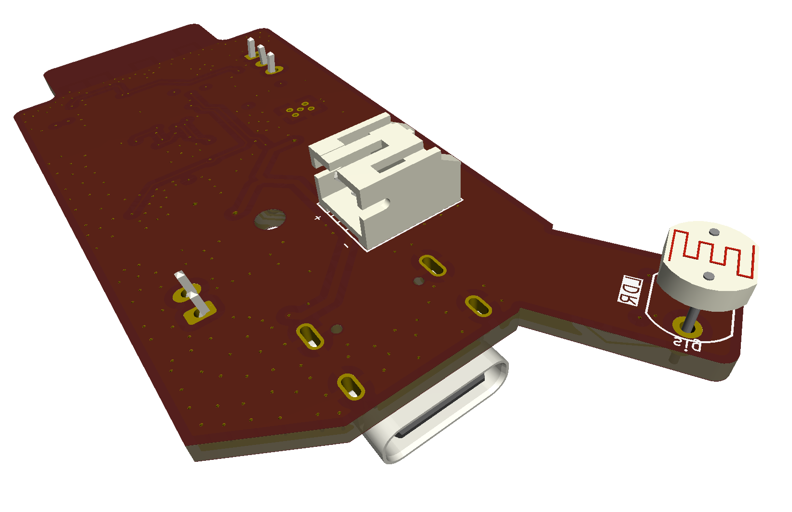
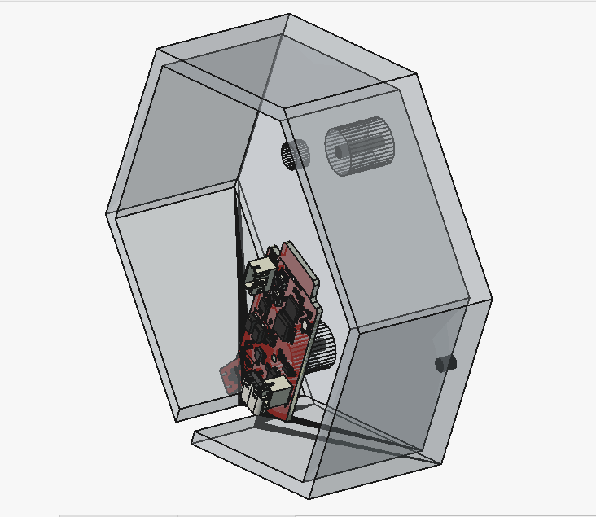

[](LICENSE_HARDWARE)
[](LICENSE_SOFTWARE)
[](https://www.espressif.com/)
[]()
[]()

# ESP32-C3 Low-Power IoT Plant Node

> Design and implementation of a compact low-power ESP32-C3 hardware platform for smart plant monitoring, environmental sensing and automated irrigation.

---

<p align="center">

</p>

---

## Overview

This repository presents the complete hardware design of a compact ESP32-C3 based IoT plant monitoring node developed as an engineering-focused redesign of a previously demonstrated smart irrigation concept.

Where the original project validated the overall application concept, this work focuses on the complete hardware architecture, RF-aware PCB layout, mixed-signal design, manufacturability, power integrity, and long-term maintainability of a production-oriented embedded platform.

The platform integrates environmental sensing, wireless communication, battery-ready power management and irrigation control within a compact four-layer PCB specifically designed for constrained enclosure geometries.

The goal of this repository is to document the engineering process behind the hardware rather than only presenting a finished PCB.

---

## Contents

- [Overview](#overview)
- [Key Features](#key-features)
- [Hardware Gallery](#hardware-gallery)
- [Repository Structure](#repository-structure)
- [Hardware Architecture](#hardware-architecture)
- [PCB Design Highlights](#pcb-design-highlights)
- [RF Design](#rf-design)
- [Manufacturing](#manufacturing)
- [Documentation](#documentation)
- [Future Work](#future-work)
- [Acknowledgements](#acknowledgements)
- [License](#license)
- [Author](#author)
- [Contact](#contact)

---

## Key Features

- Custom 4-layer PCB
- ESP32-C3 Wi-Fi MCU
- External SPI Flash
- USB-C Programming & Power
- Battery-ready architecture
- Battery charging circuitry
- Reverse polarity protection
- SHT40 Temperature & Humidity Sensor
- Capacitive Soil Moisture Interface
- MOSFET-controlled irrigation pump
- 2.4 GHz PCB antenna based on TI reference design
- RF-aware PCB layout
- Mixed-signal architecture
- Ground stitching
- Manufacturing-ready design

---

## Hardware Gallery

<p align="center">


</p>

<p align="center">

</p>

---

## Repository Structure

```text
ESP32-C3-Low-Power-IoT-Plant-Node

├── Hardware/
│   ├── KiCad Project
│   ├── Production
│   └── Libraries
│
├── Docs/
│   ├── 01_Schematic.pdf
│   └── 02_PCB_Assembly.pdf
│
├── Images/
│
├── Logos/
│
├── 3D Models/
│
├── LICENSE
└── README.md
```
### Quick Access

- 📁 [Hardware](Hardware/)
- 📁 [Docs](Docs/)
- 📁 [Images](Images/)
- 📁 [Logos](Logos/)
- 📁 [3D Models](3D%20Models/)

---

## Hardware Architecture

The platform combines multiple engineering domains within a compact embedded hardware design.

**Processing**

- ESP32-C3
- External SPI Flash

**Environmental Sensing**

- SHT40 Temperature & Humidity
- Capacitive Soil Moisture Sensor

**Irrigation**

- MOSFET Pump Driver
- External Pump Connector

**Connectivity**

- Wi-Fi
- USB-C

**Power**

- USB & Battery powered
- Battery charging supported
- Reverse polarity protection
- Battery voltage monitoring

---

## PCB Design Highlights

The PCB was designed from the ground up with emphasis on engineering practices commonly employed in professional embedded hardware development.

Highlights include

- Four-layer stack-up
- Continuous ground reference planes
- Controlled RF keep-out
- Ground stitching vias
- Short crystal routing
- Careful decoupling placement
- USB differential routing
- Mixed analog/digital partitioning
- Compact constrained mechanical form factor

---

## RF Design

The wireless subsystem employs a PCB antenna derived from Texas Instruments reference **AN043** recommendations.

The antenna region includes

- dedicated RF keep-out
- controlled ground clearance
- dedicated feed routing
- configurable matching network

The initial values of the antenna matching network (L2, C21, C22) were selected based on theoretical calculations and RF design recommendations. Although these values are expected to operate correctly, final impedance matching should be verified after fabrication. For this reason, it is recommended to initially designate L2, C21, and C22 as DNP (Do Not Populate) and populate them only after RF characterization and tuning of the assembled hardware.

Detailed RF design notes will be provided in future documentation.

---

## Manufacturing

The repository includes fabrication outputs required for PCB production.

Included

- Gerber files
- Drill files
- Fabrication outputs

A generic Bill of Materials (BOM) is provided for design reference. Manufacturer-specific part numbers and sourcing information are intentionally omitted, allowing designers the flexibility to select equivalent components based on availability, cost, or project-specific requirements.

---

## Documentation

The repository documentation is being expanded and currently includes

- Schematic
- PCB Assembly

Planned additions

- PCB Design Report
- RF Design Notes
- Signal and Power Integrity Discussion
- Design Validation

---

## Future Work

- Firmware adaptation
- Antenna impedance tuning
- Battery validation
- Power consumption characterization
- Environmental testing
- Long-term field deployment
- Companion mobile application integration

---

## Acknowledgements

The 3D planter model used in the project renders was created by **Lewis**. Full credit goes to the original author. The original model is available on the **Thingiverse** [Profile](https://www.thingiverse.com/thing:3537287).

The plant icon used on the PCB silkscreen is **"Smart Plant"** by **Anton Handal Saputra**, sourced from the **Noun Project**, and is used under the **Creative Commons Attribution 3.0 (CC BY 3.0)** license: https://thenounproject.com/browse/icons/term/smart-plant/

---

## License

The hardware design files are released under the CERN Open Hardware Licence Version 2 – Permissive (CERN-OHL-P). The accompanying files and written documentation remain © 2026 SEBBAR Mohamed and are provided for reference purposes only.

See [LICENSE](LICENSE) for details.

---

## Author

**Mohamed Sebbar**

Master's Degree in Computer Engineering and Embedded Systems

Faculty of Sciences, Agadir, Morocco

---

## Contact

If you have questions about this project, or would like to discuss the design feel free to:

- Open an [Issue](../../issues).
- Connect with me on [LinkedIn](https://www.linkedin.com/in/mohamedsebbar/).
- Or contact me via [email](mailto:sebbar.mohamed66@gmail.com).
